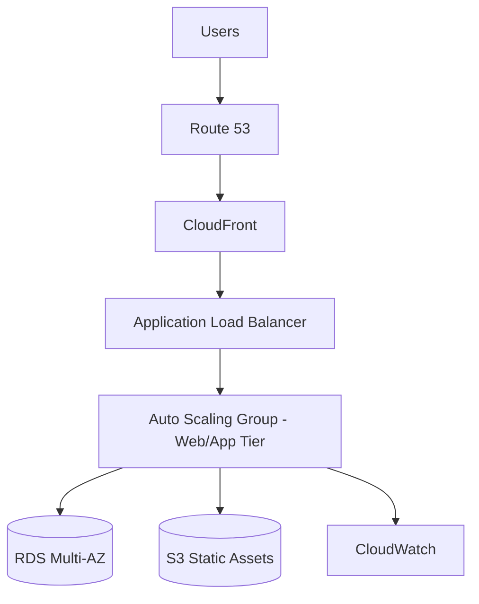
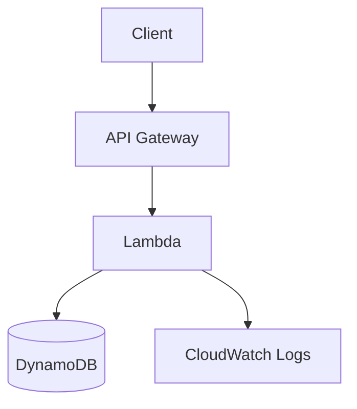
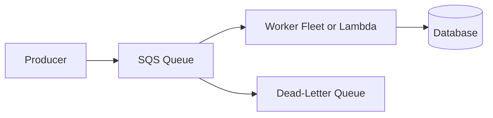
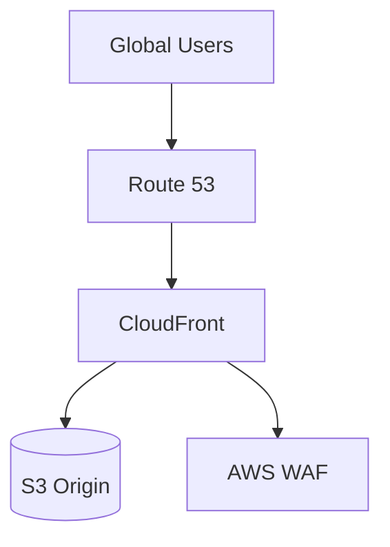
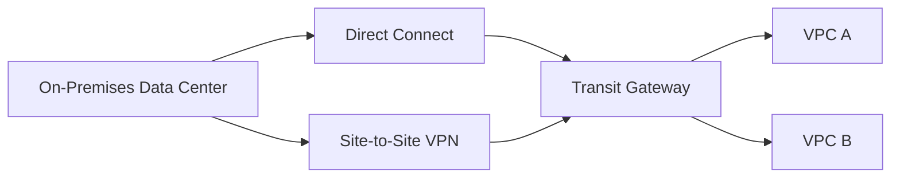

# Common Architecture Patterns

## Three-Tier Web Application

Use when:

- You need a classic scalable web app.
- You need managed relational database storage.
- You need high availability across Availability Zones.

## Serverless API

Use when:

- You want low operational overhead.
- Traffic is variable.
- Event-driven execution fits the workload.

## Decoupled Processing

Use when:

- Producers and consumers scale differently.
- You need buffering.
- Failures should not immediately break the whole workflow.

## Global Static Content

Use when:

- Content is static or cacheable.
- Users are geographically distributed.
- You need lower latency and edge caching.

## Hybrid Connectivity

Use when:

- A company needs private connectivity to AWS.
- Multiple VPCs need centralized routing.
- VPN can be backup for Direct Connect.
